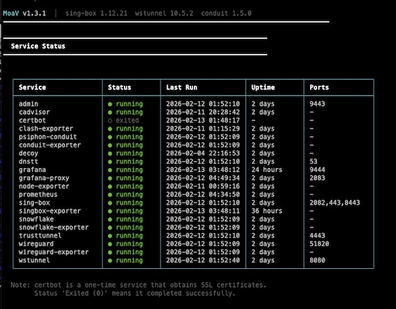
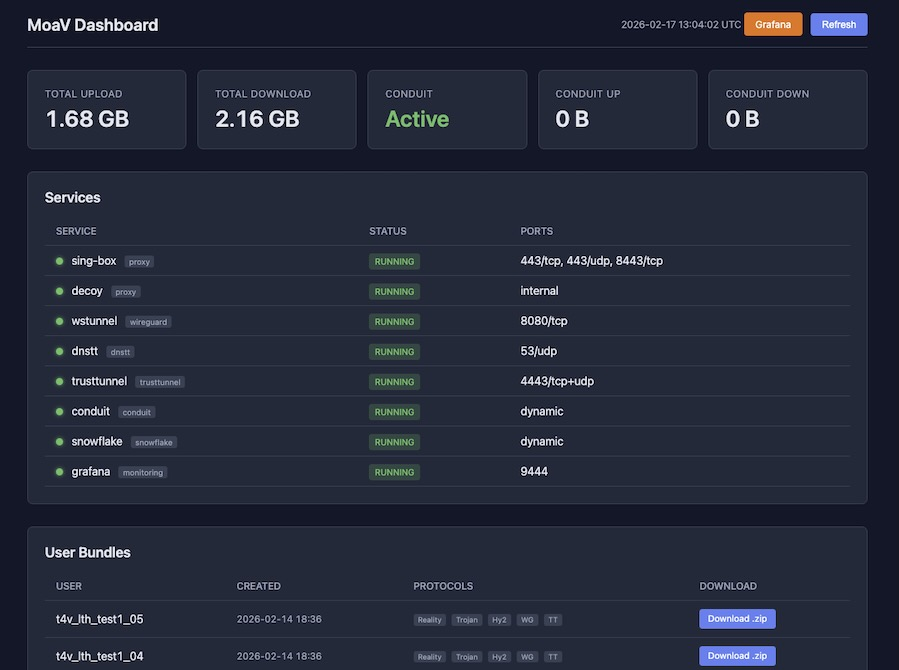

# MoaV Setup Guide

Complete guide to deploy MoaV on a VPS or home server.

## Prerequisites

**Server Requirements:**
- Debian 12, Ubuntu 22.04, or Ubuntu 24.04 (Raspberry Pi OS works too)
- Architecture: x64 (AMD64) or ARM64 (Raspberry Pi 4, Apple Silicon)
- Minimum: 1 vCPU, 1GB RAM, 10GB disk
- Public IPv4 address
- Public IPv6 address (optional, see [IPv6 Support](#ipv6-support))

**Domain (Optional but Recommended):**
- Required for: Reality, Trojan, AnyTLS, Hysteria2, TrustTunnel, CDN mode, DNS tunnels (dnstt, Slipstream, XDNS)
- Not required for: Reality, WireGuard, AmneziaWG, Telegram MTProxy, Admin dashboard, Conduit, Snowflake
- See [Domainless Mode](#domainless-mode) if you don't have a domain

**Ports to Open:**

| Port | Protocol | Service | Requires Domain |
|------|----------|---------|-----------------|
| 443/tcp | TCP | Reality (VLESS) | Yes |
| 443/udp | UDP | Hysteria2 | Yes |
| 8443/tcp | TCP | Trojan | Yes |
| 8445/tcp | TCP | AnyTLS | Yes |
| 8388/tcp+udp | TCP+UDP | Shadowsocks-2022 | No |
| 4443/tcp+udp | TCP+UDP | TrustTunnel | Yes |
| 2082/tcp | TCP | CDN WebSocket | Yes (Cloudflare) or No (CloudFront) |
| 51820/udp | UDP | WireGuard | No |
| 51821/udp | UDP | AmneziaWG | No |
| 8080/tcp | TCP | wstunnel | No |
| 9443/tcp | TCP | Admin dashboard | No |
| 9444/tcp | TCP | Grafana (monitoring) | No |
| 993/tcp | TCP | Telegram MTProxy (telemt) | No |
| 2096/tcp | TCP | XHTTP (VLESS+XHTTP+Reality) | No |
| 53/udp | UDP | DNS tunnels — dnstt, Slipstream, MasterDNS, XDNS (all 4 share port 53 via dns-router) | Yes |
| 8444/tcp | TCP | GooseRelay (when `ENABLE_GOOSERELAY=true`) | No |
| 80/tcp | TCP | Let's Encrypt | Yes (during setup) |

---

## Quick Start

The fast path — install and first user in a few minutes — is [Quick Start](quick-start.md). The rest of this page is the reference: every option, and what to do when the defaults don't fit.

## Step-by-Step Setup

### Step 1: Get a Server

Choose a VPS provider and create a server:

| Provider | Minimum Plan | Price | Deploy Guide |
|----------|--------------|-------|--------------|
| Hetzner | CX22 (2 vCPU, 4GB) | €5.39/mo | [DEPLOY.md#hetzner](DEPLOY.md#hetzner) |
| DigitalOcean | Basic (1 vCPU, 1GB) | $6/mo | [DEPLOY.md#digitalocean](DEPLOY.md#digitalocean) |
| Vultr | 25GB SSD (1 vCPU, 1GB) | $5/mo | [DEPLOY.md#vultr](DEPLOY.md#vultr) |
| Linode | Nanode 1GB | $5/mo | [DEPLOY.md#linode](DEPLOY.md#linode) |

- VPS Price Trackers: [VPS-PRICES](https://vps-prices.com/)، [VPS Price Tracker](https://vpspricetracker.com/), [Cheap VPS Price Cheat Sheet](https://docs.google.com/spreadsheets/d/e/2PACX-1vTOC_THbM2RZzfRUhFCNp3SDXKdYDkfmccis4vxr7WtVIcPmXM-2lGKuZTBr8o_MIJ4XgIUYz1BmcqM/pubhtml)
- [Time4VPS](https://www.time4vps.com/?affid=8471): 1 vCPU، 1GB RAM، IPv4، 3.99€/ماه 


**Home Server:** Raspberry Pi 4 (2GB+ RAM) or any ARM64/x64 Linux works. See [DNS.md](DNS.md#home-server-raspberry-pi) for dynamic DNS setup.


### Step 2: Configure DNS

Point your domain to your server **before** running setup.

**Minimum DNS Records:**

| Type | Name | Value | Notes |
|------|------|-------|-------|
| A | @ | YOUR_SERVER_IP | Main domain |

**Additional Records (for all features):**

| Type | Name | Value | Notes |
|------|------|-------|-------|
| A | dns | YOUR_SERVER_IP | For DNS tunnel NS delegation |
| NS | t | dns.yourdomain.com | dnstt tunnel subdomain |
| NS | s | dns.yourdomain.com | Slipstream tunnel subdomain |
| NS | m | dns.yourdomain.com | MasterDNS tunnel subdomain |
| NS | x | dns.yourdomain.com | XDNS tunnel subdomain |
| A | cdn | YOUR_SERVER_IP | CDN mode (Cloudflare: **Proxied** orange cloud) |

**Important:** For Cloudflare users, the main `@` record must be **DNS only** (gray cloud). Only the `cdn` record should be **Proxied** (orange cloud).

See [DNS.md](DNS.md) for provider-specific instructions.

**Verify DNS is working:**
```bash
dig +short yourdomain.com
# Should return your server IP

# Or use MoaV's built-in DNS check (after install):
moav doctor dns
```

### Step 3: Install MoaV

SSH into your server and run:

```bash
curl -fsSL moav.sh/install.sh | bash
```

This installs:
- Docker and Docker Compose
- Git and qrencode
- MoaV to `/opt/moav`
- `moav` command (available globally)

**Manual Installation** (if you prefer):
```bash
# Install Docker
curl -fsSL https://get.docker.com | sh

# Install dependencies
apt install -y git qrencode

# Clone MoaV
git clone https://github.com/MotherofallVPNs/moav.git /opt/moav
cd /opt/moav
```

### Step 4: Configure Environment

```bash
cd /opt/moav
cp .env.example .env
nano .env
```

**Required Settings:**

```bash
# Your domain (must match DNS from Step 2)
DOMAIN=yourdomain.com

# Email for Let's Encrypt certificates
ACME_EMAIL=you@example.com

# Admin dashboard password (change this!)
ADMIN_PASSWORD=your-secure-password
```

**Optional Settings:**

```bash
# Server IP (auto-detected if empty)
SERVER_IP=

# Initial users to create (default: 5)
INITIAL_USERS=5

# Reality target (site to impersonate)
# Good choices: dl.google.com, www.apple.com, www.doi.org
REALITY_TARGET=dl.google.com:443

# CDN domain (optional, Cloudflare-proxied subdomain)
CDN_DOMAIN=cdn.yourdomain.com

# Enable/disable services
ENABLE_REALITY=true
ENABLE_TROJAN=true
ENABLE_HYSTERIA2=true
ENABLE_WIREGUARD=true
ENABLE_DNSTT=true
ENABLE_TRUSTTUNNEL=true
ENABLE_PSIPHON_CONDUIT=false
ENABLE_ADMIN_UI=true
```

### Step 5: Run Bootstrap

Initialize MoaV (generates keys, obtains certificates, creates users):

```bash
moav bootstrap
# Or manually:
docker compose --profile setup run --rm bootstrap
```

This will:
1. Generate Reality and dnstt keypairs
2. Obtain TLS certificate from Let's Encrypt
3. Generate WireGuard server keys
4. Create initial users (default: 5)
5. Generate user bundles with configs and QR codes

> The domain prompt accepts your domain in any form (`example.com`, `https://example.com/`, `example.com:443` — all work). If you stop mid-way, re-running `moav bootstrap` picks up where you left off.

**DNS Tunnel Preparation** (optional):

If you want to use the DNS tunnel, free port 53 first:
```bash
# Stop systemd-resolved (uses port 53)
systemctl stop systemd-resolved
systemctl disable systemd-resolved

# Set up direct DNS
echo -e "nameserver 1.1.1.1\nnameserver 8.8.8.8" > /etc/resolv.conf
```

### Step 6: Start Services

 <a href="../site/demos/services.webm">(demo video)</a>

```bash
# Start all services
moav start

# Or start specific profiles
moav start proxy admin          # Main proxy + dashboard
moav start proxy admin wireguard # Add WireGuard
moav start all                   # Everything
```

See [CLI Reference → Profiles](CLI.md#profiles) for the full profile/service/`ENABLE_*` matrix. Common profiles: `proxy`, `xhttp`, `wireguard`, `amneziawg`, `dnstunnel`, `trusttunnel`, `telegram`, `admin`, `conduit`, `snowflake`, `gooserelay`, `monitoring`. From 1.8.2, `moav start` filters profiles whose `ENABLE_*` is `false` in `.env` — disabled services never start by accident.

**Open Firewall Ports:**
```bash
# Proxy services
ufw allow 443/tcp    # Reality
ufw allow 443/udp    # Hysteria2
ufw allow 8443/tcp   # Trojan
ufw allow 8445/tcp   # AnyTLS
ufw allow 8388       # Shadowsocks-2022

# TrustTunnel
ufw allow 4443/tcp   # HTTP/2
ufw allow 4443/udp   # HTTP/3 (QUIC)

# CDN (if using)
ufw allow 2082/tcp   # CDN WebSocket

# WireGuard
ufw allow 51820/udp  # Direct
ufw allow 8080/tcp   # wstunnel

# AmneziaWG
ufw allow 51821/udp   # Obfuscated WireGuard

# XHTTP
ufw allow 2096/tcp   # VLESS+XHTTP+Reality

# DNS tunnel
ufw allow 53/udp

# Admin
ufw allow 9443/tcp

# Monitoring (Grafana)
ufw allow 9444/tcp
```

**Verify Services:**
```bash
moav status
moav doctor              # Run all diagnostic checks
```

### Step 7: Download User Bundles

 <a href="../site/demos/admin-dashboard.webm">(demo video)</a>

User bundles are ready in `outputs/bundles/`:

```bash
ls outputs/bundles/
# user01/ user02/ user03/ user04/ user05/
```

**Each bundle contains:**
- `README.html` - User instructions (English + Farsi)
- `reality.txt` - Reality share link + QR code
- `trojan.txt` - Trojan share link
- `anytls.txt` - AnyTLS share link (if `ENABLE_ANYTLS=true`)
- `shadowsocks.txt` / `shadowsocks-qr.png` - Shadowsocks-2022 `ss://` URI + QR
- `hysteria2.txt` - Hysteria2 share link
- `cdn-vless.txt` - CDN share link (if CDN_DOMAIN set)
- `wireguard.conf` - WireGuard config + QR code
- `wireguard-wstunnel.conf` - WireGuard over WebSocket
- `amneziawg.conf` - AmneziaWG config (if enabled)
- `trusttunnel.txt` - TrustTunnel credentials (if enabled)
- `xhttp.txt` - XHTTP share link (if enabled)
- `dnstt-instructions.txt` - DNS tunnel instructions

**Download Options:**

**1. Admin Dashboard (Easiest):**
1. Open `https://your-server:9443` in browser
2. Login with username `admin` and your `ADMIN_PASSWORD`
3. Click **Download** next to any user in the "User Bundles" section

**Creating users from the dashboard:**
1. Click **+ Create User** in the User Bundles section
2. Enter a username (e.g. `alice`)
3. For multiple users, check **Batch** and enter a count — creates `alice_01`, `alice_02`, etc.
4. Click **Create** and wait for completion

**2. Create a Zip Package:**
```bash
moav user package user01
# Creates: outputs/bundles/user01.zip
```

**3. SCP Download:**
```bash
# From your local machine
scp root@YOUR_SERVER:/opt/moav/outputs/bundles/user01.zip ./
# Or the whole folder
scp -r root@YOUR_SERVER:/opt/moav/outputs/bundles/user01 ./user01-bundle/
```

### Step 8: Distribute to Users

Send the bundle (or just the README.html + relevant protocol files) to users.

**Secure Distribution:**
- **In-person** - Safest. Show QR code or AirDrop
- **Signal** - Send files with disappearing messages
- **Encrypted email** - PGP or ProtonMail-to-ProtonMail

**Avoid:**
- Unencrypted email
- Public file sharing links
- SMS/Telegram regular chats

Users open `README.html` in their browser for instructions and QR codes.

---

## Domainless Mode

Leave `DOMAIN=` empty in `.env` and MoaV starts only the transports that need no certificate.
Which protocols those are, the ports to forward, and the home-server/dynamic-IP caveats are all in
**[DNS → Without a domain](DNS.md#without-a-domain)**.

Adding a domain later is non-destructive: set `DOMAIN=` and run `moav bootstrap`. Existing users keep
working and pick up the new protocols on their next bundle.

## CDN-Fronted Mode (Cloudflare)

CDN mode fronts VLESS+WebSocket behind a CDN so the client appears to talk to Cloudflare or AWS.

The DNS records, the two mandatory Cloudflare settings (Origin Rule → port 2082 and SSL/TLS
Flexible), the AWS CloudFront alternative that needs no domain, and the `521`/`525` diagnosis table
are all in **[DNS → CDN mode](DNS.md#cdn-mode)** and the provider tabs beside it.

What lives here is the MoaV side — the `.env` variables:

| Variable | Purpose |
|---|---|
| `CDN_SUBDOMAIN` | Cloudflare subdomain to front (default `cdn`); leave empty when using CloudFront |
| `CDN_DOMAIN` | The hostname the CDN serves (`cdn.yourdomain.com`, or `d123.cloudfront.net`) |
| `CDN_ADDRESS` | What clients actually connect to — set to `www.yourdomain.com` for stealth |
| `CDN_SNI` | SNI presented by the client |
| `CDN_TRANSPORT` | `httpupgrade` (Cloudflare default) or `ws` (**required** for CloudFront) |
| `CDN_WS_PATH` | Generated automatically with 48-bit entropy; treat it as a secret |

After changing any of these, run `moav bootstrap` to re-render, then `moav regenerate-users` so
existing bundles carry the new CDN link.

## Choosing a Reality Target (SNI)

Reality protocols (VLESS+Reality and XHTTP+Reality) impersonate a legitimate website during the TLS handshake. The **Reality target** (also called SNI) is the domain your proxy pretends to be. DPI sees a normal TLS connection to that domain, not a proxy.

### Requirements

The target domain **must** support:
- **TLS 1.3** — required for Reality's handshake
- **HTTP/2 (h2)** — required for ALPN negotiation

### How to Verify a Target

Test any domain **from your server** (not locally — some domains are geo-restricted):

```bash
curl -vsI --tlsv1.3 --http2 https://TARGET_DOMAIN 2>&1 | grep -iE "SSL|ALPN|TLSv1.3"
```

**Good output** (both TLS 1.3 and h2 — wording varies by curl version):
```
* SSL connection using TLSv1.3 / TLS_AES_256_GCM_SHA384
* ALPN: server accepted h2
```

If you get no output or the connection closes immediately, the domain either doesn't support TLS 1.3/H2 or is unreachable from your server — don't use it.

### Choosing a Good Target

**For censored regions (Iran, China, Russia, etc.):**

Avoid well-known targets like `google.com` or `microsoft.com` — censors monitor these heavily and can detect Reality by comparing your handshake to the real site.

Instead, choose a domain that:
1. **Is popular domestically** — blocking it would cause collateral damage (banks, fintech, e-commerce)
2. **Has heavy TLS traffic** — your connection blends in with millions of real users
3. **Isn't commonly used as a proxy target** — novel targets are harder to fingerprint

**Examples for Iran:**

| Domain | Why |
|--------|-----|
| `blubank.com` | Major fintech app, high traffic, can't be easily blocked |
| `divar.ir` | Popular classifieds site |
| `snapp.ir` | Ride-hailing app (like Uber) |

**Generic (less optimal but widely compatible):**

| Domain | Notes |
|--------|-------|
| `dl.google.com` | Default, works everywhere but well-known |
| `www.doi.org` | Academic, low profile |
| `gateway.icloud.com` | Apple services |

> **Tip:** The best target is one that your ISP cannot afford to block. A domestic banking site is harder to block than a foreign tech company.

### Configuration

```bash
# In .env — for sing-box (Reality VLESS)
REALITY_TARGET=blubank.com:443

# For Xray-core (XHTTP) — can be different from sing-box
XHTTP_REALITY_TARGET=blubank.com:443
```

After changing targets, re-bootstrap and regenerate user bundles:
```bash
moav bootstrap
moav user regenerate
```

> **Note:** `REALITY_TARGET` and `XHTTP_REALITY_TARGET` are independent — you can use different targets for each protocol to diversify your fingerprint.

---

## Managing Users

```bash
moav user add alice              # create a user (keys, configs, QR codes)
moav user add alice --package    # ...and build the distributable zip
moav user add --batch 10         # bulk-create
moav user list                   # who exists
moav user base64 alice           # that user's subscription string
moav user revoke alice           # remove access (destructive)
moav regenerate-users            # rebuild every bundle from state; keys unchanged
```

Bundles land in `outputs/bundles/<user>/`. Every flag and subcommand: **[CLI Reference](CLI.md)**.

## Service Management

```bash
moav status                      # per-container health and which profiles are up
moav start [service|profile]     # 'moav start all' brings up everything
moav stop  [service]
moav restart [service]
moav logs [service]              # first stop when something misbehaves
moav doctor                      # diagnostics: DNS, ports, certs, resources
```

Profiles group the services (`proxy`, `wireguard`, `amneziawg`, `dnstunnel`, `trusttunnel`, `xhttp`,
`telegram`, `admin`, `conduit`, `snowflake`, `monitoring`). Full reference: **[CLI](CLI.md)**.

## Server Migration

Export your MoaV configuration and migrate to a new server.

**Export:**
```bash
moav export
# Creates: moav-backup-YYYYMMDD_HHMMSS.tar.gz
```

Includes: `.env`, keys, user credentials, bundles.

**Import on New Server:**
```bash
# 1. Install MoaV on new server (Steps 1-3)

# 2. Copy backup to new server
scp moav-backup-*.tar.gz root@NEW_SERVER:/opt/moav/

# 3. Import
cd /opt/moav
moav import moav-backup-*.tar.gz

# 4. Update to new IP
moav migrate-ip $(curl -s https://api.ipify.org)

# 5. Update DNS to point to new server

# 6. Start services
moav start
```

---

## IPv6 Support

MoaV supports dual-stack (IPv4 + IPv6). When enabled, user bundles include both IPv4 and IPv6 connection options.

**Enable:**
1. Enable IPv6 on your VPS (usually in provider control panel)
2. Verify: `curl -6 -s https://api6.ipify.org`
3. If already set up, regenerate bundles: `moav regenerate-users`

**Disable:**
```bash
# In .env
SERVER_IPV6=disabled
```

**Note:** IPv6 is optional. Most censored regions have low IPv6 adoption, so it's a "nice to have" but not critical for circumvention.

---

## Bandwidth Donation (Conduit & Snowflake)

Donate bandwidth to help others bypass censorship. Both services can run simultaneously.

**Psiphon Conduit** — Donate bandwidth to Psiphon's relay network (millions of users worldwide):
```bash
# Start
moav start conduit

# Configure bandwidth and max clients (interactive)
moav donate setup    # Select option 2: Conduit

# View Ryve deep link and QR code (for claiming in Ryve app)
moav donate info

# Check stats (connected clients, bandwidth donated)
moav donate status
```

**Tor Snowflake** — Donate bandwidth as a Tor Snowflake proxy:
```bash
# Start
moav start snowflake

# Configure bandwidth and capacity (interactive)
moav donate setup    # Select option 3: Snowflake

# Check stats (people served, bandwidth relayed)
moav donate status
```

**Configuration in `.env`:**
```bash
CONDUIT_BANDWIDTH=100              # Mbps limit (default: 100)
CONDUIT_MAX_COMMON_CLIENTS=200     # Max concurrent clients (default: 200)
SNOWFLAKE_BANDWIDTH=5              # Mbps limit (default: 5)
SNOWFLAKE_CAPACITY=50              # Max concurrent clients (default: 50)
```

Changes via `moav donate setup` are written to `.env` and the service is restarted automatically.

---

## MahsaNet Config Donation

> Donating configs is a way to support the network rather than a setup step; this will move to a dedicated Support page. It stays here for now because that page does not exist yet.

Donate your server's VPN configs to [MahsaServer.com](https://www.mahsaserver.com/), a decentralized config sharing platform for the Mahsa VPN app (2M+ users in Iran). Mahsa VPN users connect directly to your donated configs.

### Prerequisites

1. **Register** at [mahsaserver.com](https://www.mahsaserver.com/) and verify your email
2. **Become a verified donor** — fill out the verified donor form on the website
3. **Generate an API key** at [mahsaserver.com/user/api](https://www.mahsaserver.com/user/api)

### Setup

```bash
# Set up your API key (interactive — validates the key)
moav donate setup    # Select option 1: MahsaNet
```

Or manually add to `.env`:
```bash
MAHSANET_API_KEY=your_api_key_here
```

### Configuration

Configure in `.env`:

```bash
# Protocols to donate (space-separated)
# Supported: reality, hysteria2, trojan, cdn, xhttp, telegram
MAHSANET_PROTOCOLS="reality hysteria2"

# Pool determines where configs appear in the Mahsa VPN app
# Options: mahsa (default), warp, popup, telegram
# Note: telegram protocol configs are always sent to the "telegram" pool regardless of this setting
MAHSANET_POOL=mahsa
```

**Protocol notes:**
- `reality` — VLESS+Reality, works without a domain, recommended
- `hysteria2` — QUIC-based, fast, requires domain + UDP
- `trojan` — TLS-based, requires domain
- `cdn` — VLESS+WS via Cloudflare, requires CDN setup
- `xhttp` — VLESS+XHTTP+Reality via Xray-core, requires xhttp profile
- `telegram` — Telegram MTProxy link, automatically goes to the "telegram" pool

### Donating Configs

```bash
# Generate new users and donate their configs
moav donate

# You'll be prompted for:
#   - Number of users to create (default: 1)
#   - Username prefix (default: mahsa)
```

This creates dedicated users (e.g., `mahsa01`, `mahsa02`) and submits their config share links to MahsaNet.

### Managing Donations

```bash
# Show all donation services status (MahsaNet + Conduit + Snowflake stats)
moav donate status

# List your donated MahsaNet configs
moav donate list

# Select and delete specific configs
moav donate delete

# Remove all donated configs from MahsaNet
moav donate remove
```

### Admin Dashboard

When `MAHSANET_API_KEY` is set, the Admin Dashboard shows a **MahsaNet** section where you can:

- View donation stats (total, active, inactive configs)
- Donate new configs (with count, prefix, and protocol selection)
- See all donated configs with health status and usage count
- Collapse the section to a one-liner summary

### How It Works

1. `moav donate` creates new MoaV users with the standard user provisioning pipeline
2. For each user, it reads the share link files (e.g., `reality.txt`, `hysteria2.txt`)
3. Each link is validated (correct prefix, structure, length)
4. Links are submitted to the MahsaNet API as config donations
5. Mahsa VPN users worldwide can then connect through your server

---

## Monitoring (Grafana + Prometheus)

Optional Grafana + Prometheus stack. Enable with `ENABLE_MONITORING=true` (the installer defaults
it on above ~1 GB RAM) and start it with `moav start monitoring`.

Dashboards, the exporters, reaching Grafana, and the CDN-accelerated option are covered in
**[Monitoring](MONITORING.md)**.

## Updating MoaV

```bash
moav update
```

Or manually:
```bash
cd /opt/moav
git pull
docker compose --profile all build
moav restart
```

### Breaking Changes

Some updates include breaking changes that require regenerating configs. Check the [CHANGELOG](https://github.com/MotherofallVPNs/moav/blob/main/CHANGELOG.md) for breaking change notices.

**If an update has breaking changes:**
```bash
# Option 1: Rebuild configs (keeps users, regenerates server config)
moav config rebuild
moav restart

# Option 2: Fresh start (new keys, new users)
moav uninstall --wipe
cp .env.example .env
nano .env  # Configure domain, email, password
./moav.sh bootstrap
```

After breaking changes, you must redistribute new config bundles to all users.

### Testing a Development Branch

```bash
moav update -b dev      # Switch to dev branch

# Return to stable:
moav update -b main
```

---

## Uninstalling MoaV

### Keep Data (Reinstall Later)

Remove containers but preserve configuration for later:

```bash
moav uninstall
```

This removes:
- All Docker containers
- Global `moav` command

Preserves: `.env`, keys, certificates, user bundles, Docker volumes

To reinstall:
```bash
./moav.sh install
moav start
```

### Complete Removal (Fresh Start)

Remove everything for a completely fresh installation:

```bash
moav uninstall --wipe
```

This removes:
- All Docker containers and volumes
- `.env` and all generated configs
- All keys and certificates
- All user bundles

To start fresh:
```bash
cp .env.example .env
nano .env  # Configure domain, email, password
./moav.sh
```

---

## Re-bootstrapping

If you need to regenerate keys without a full wipe:

```bash
# Remove bootstrap flag only
docker run --rm -v moav_moav_state:/state alpine rm /state/.bootstrapped

# Re-run bootstrap
moav bootstrap
```

---

## CLI Reference

See [CLI.md](CLI.md) for complete command reference.

## Troubleshooting

See [TROUBLESHOOTING.md](TROUBLESHOOTING.md) for common issues and solutions.

## Security

See [OPSEC.md](OPSEC.md) for security best practices.
