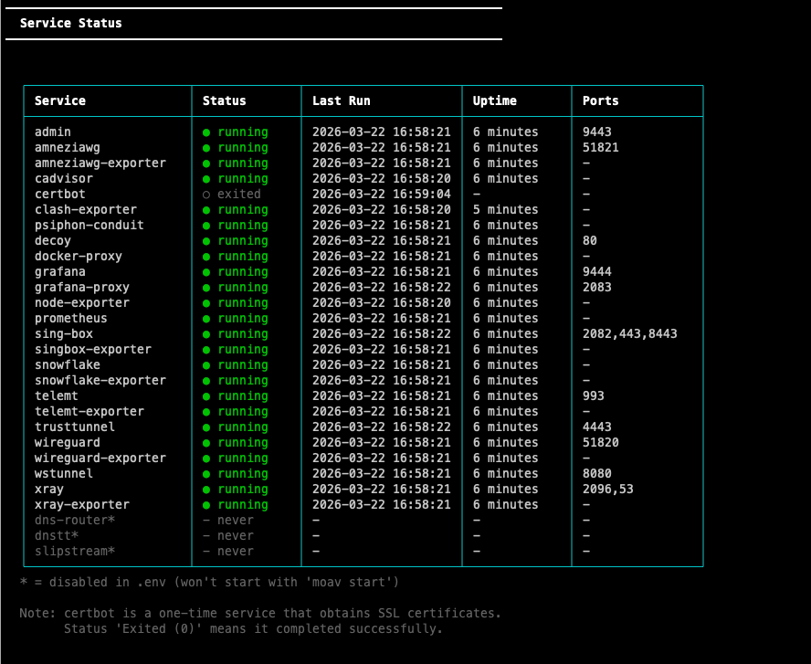
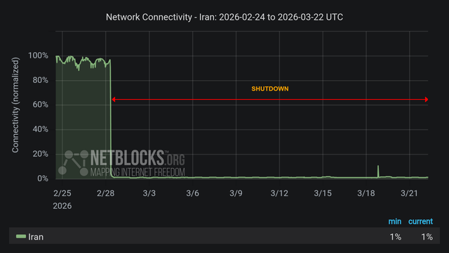
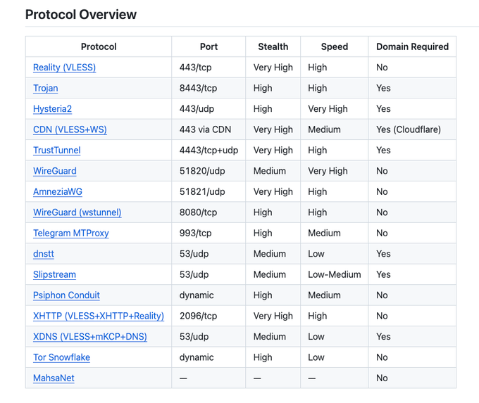
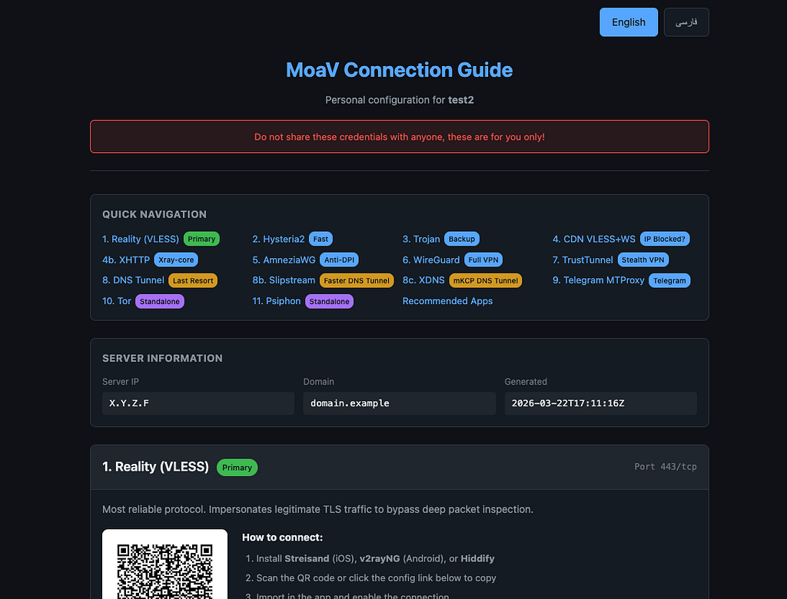
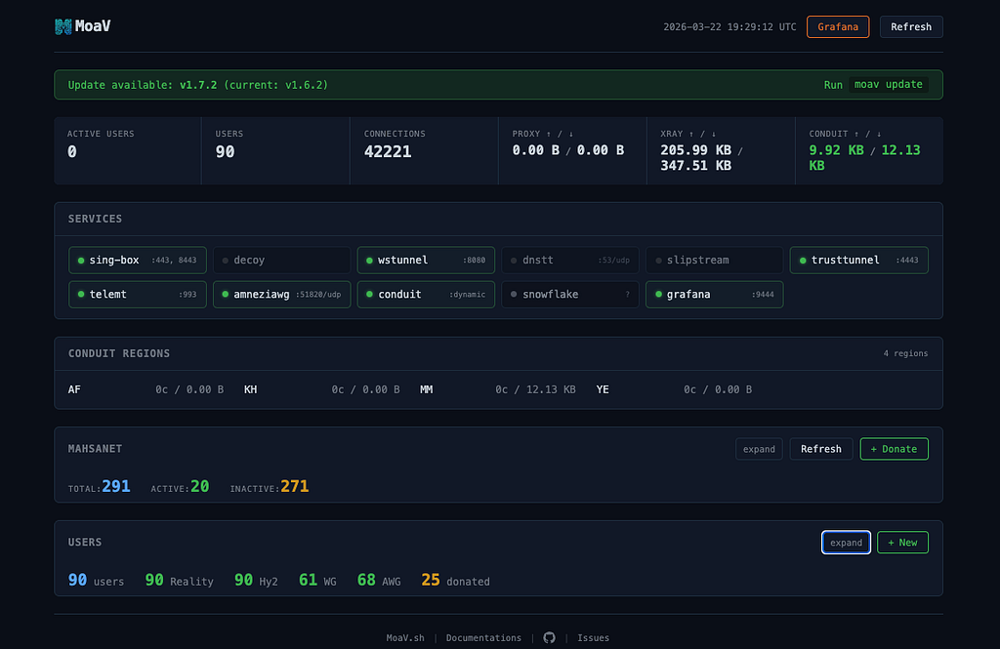
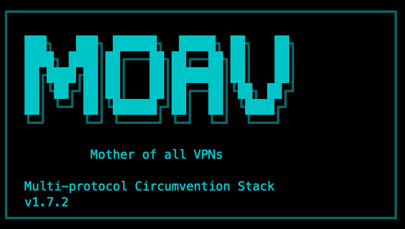

<p class="post-meta">2026-03-22 · Essay · 10 min read · <a href="../../">The MoaV Blog</a></p>

# MoaV: 16+ Protocols, One Server — Why Anti-Censorship Needs Infrastructure, Not Just Tools

!!! info "Originally published on Medium"
    This post first appeared on Medium on 22 March 2026, written by Shayan Eskandari ([@sbetamc](https://x.com/sbetamc)). It is republished here unchanged: [MoaV: 16+ Protocols, One Server — Why Anti-Censorship Needs Infrastructure, Not Just Tools](https://medium.com/@sbetamc/moav-16-protocols-one-server-why-anti-censorship-needs-infrastructure-not-just-tools-e989f0b9c426)

> A censorship-free internet won't come from a better VPN app. It will come from thousands of people each running a server. [*MoaV*](https://moav.sh/) makes that possible.

> *This article was originally posted on X:* [*https://x.com/sbetamc/status/2035816069542428731*](https://x.com/sbetamc/status/2035816069542428731)

<figure markdown="span">

<figcaption><code>moav status</code> showing all the internet censorship circumvention protocols running simultaneously</figcaption>
</figure>

### Decades of Censorship, Years of Shutdowns

Iran's internet censorship is not new. For over [two decades](https://ioda.inetintel.cc.gatech.edu/reports/a-comparative-look-at-internet-shutdowns-in-iran-2019-2022-2026-and-2026/), the Islamic Republic has filtered websites, throttled international bandwidth, and blocked platforms. Iranians have cycled through Psiphon, Lantern, Tor, countless VPNs; always one step behind the next crackdown. Then came the Zan Zendegi Azadi ([Woman, Life, Freedom](https://en.wikipedia.org/wiki/Woman,_Life,_Freedom_movement)) movement. Over the past two years, [what was filtering became full shutdowns](https://blog.cloudflare.com/iran-protests-internet-shutdown/). Not throttling — disconnection. Entire regions cut off. Mobile data killed. International gateways choked to near-zero throughput.

The censorship apparatus today is state-scale infrastructure: Deep Packet Inspection at every peering point. Protocol whitelisting that drops everything except authorized DNS, HTTP, and HTTPS. Active probing that connects to suspected VPN servers and fingerprints them. Entire cloud provider IP ranges blacklisted. Clean server IPs burned within days, sometimes hours.

January through March 2026 has been the most severe chapter yet. Protocols that worked in January got blocked by February. Configurations that survived February failed in March. By the fourth week of March 2026, almost nothing external works from inside Iran — only people with access to a Starlink proxy middleman, or the new XDNS approach that barely pushes Telegram messages through DNS packets.

<figure markdown="span">

<figcaption>After 528 hours, <a href="https://x.com/search?q=%23Iran&src=hashtag_click">#Iran</a> is entering a 23rd day isolated from the world as the regime-imposed internet blackout continues in its fourth week. <a href="https://x.com/netblocks/status/2035618983722758254">https://x.com/netblocks/status/2035618983722758254</a></figcaption>
</figure>

This is not a problem a better protocol solves. This is a problem that requires a different approach entirely.

### The Infrastructure Thesis

A single VPN server is a single point of failure. The regime doesn't just block protocols, it blocks IPs. One server helps fifty people until it gets burned. Then those fifty people have nothing.

The censorship apparatus is state-scale infrastructure. The response must be infrastructure too.

[MoaV.sh](https://moav.sh/) exists to make it possible for anyone — *anyone with a $5/month VPS or a Raspberry Pi at home* — to become a node in a decentralized anti-censorship network. One command deploys 16+ protocols, monitoring, user management, and bandwidth donation to three networks that serve millions. The barrier to running a server should be as low as possible, because the answer to censorship is not one resilient server — it is ten thousand disposable ones.

If ten people read this and each deploy a MoaV server, that's 160 protocol endpoints. If each server helps 50 people, that's 500 people with internet access. If those servers also donate bandwidth to Psiphon, Snowflake and MahsaNet, the reach extends to millions.

That's not a tool. That's infrastructure.

### What is MoaV?

> ***Initial MoaV announcement (Feb 1, 2026):*** [*https://x.com/sbetamc/status/2018026596645413245*](https://x.com/sbetamc/status/2018026596645413245)

**MoaV (Mother of all VPNs)** is a self-hosted server stack that deploys 16+ anti-censorship protocols simultaneously. Open-source, MIT-licensed, Docker-based.

**Only Two Commands**

```bash
curl -fsSL https://moav.sh/install | bash
moav
```

**What you get:**

- 16+ VPN/proxy protocols running simultaneously
- Grafana dashboards with real-time monitoring and GeoIP
- Admin panel for user management
- User bundle readme with QR codes, configs, and guide on how to connect
- Bandwidth donation to Psiphon, Tor, and MahsaNet

No Docker expertise required. No manual config files.

[Watch the walkthrough on X.](https://x.com/i/status/2035816069542428731)

### The Protocol Arsenal

Every protocol exploits a different gap in the censor's capabilities. When one gets blocked, users switch to another. That's the design philosophy.

<figure markdown="span">

<figcaption>All supported protocols by MoaV 1.7.2</figcaption>
</figure>

**First Line of Defense — Stealth**

These make your traffic look like something the censor can't afford to block.

- **Reality (VLESS)**: The primary protocol. Traffic is indistinguishable from a real TLS connection to `dl.google.com` (configurable). The server presents the target's genuine certificate. Even active probing can't tell the difference. Powered by sing-box.
- **XHTTP (VLESS+XHTTP+Reality)** — Powered by Xray-core. Splits VPN traffic into separate HTTP connections with no distinctive ALPN fingerprint. DPI cannot distinguish it from regular web browsing. No domain required.
- **TrustTunnel** — HTTP/2 and HTTP/3 (QUIC) VPN transport. Looks like regular HTTPS traffic — indistinguishable from someone loading a web app.
- **CDN (VLESS+WS)** — Routes traffic through Cloudflare's CDN network. Works when your server's IP is blocked. The censor would have to block all of Cloudflare to stop it.

**When You Need Speed — Performance**

- **Hysteria2:** QUIC-based, optimized for high throughput on lossy networks. Built-in obfuscation bypasses QUIC blocking. The fastest protocol when UDP is available.
- **WireGuard:** Kernel-level VPN. Extremely fast. When direct UDP is blocked, MoaV can tunnel it through WebSocket (wstunnel) over TCP.
- **AmneziaWG:** Modified WireGuard with anti-DPI obfuscation. Defeats the header-based detection that blocks standard WireGuard in Iran, China, and Russia.

**When Everything Else Is Blocked — DNS Tunnels**

When the internet is reduced to DNS queries, these protocols still work. Slow, but functional. When you need them, you *need* them.

- **dnstt:** Encodes VPN traffic inside DNS queries. Works when literally everything except DNS is blocked. Last-resort connectivity by David Fifield (Stanford).
- **Slipstream:** QUIC-over-DNS tunnel. 1.5–5x faster than dnstt. The fastest DNS-based option.
- **XDNS (VLESS+mKCP+DNS):** *New in v1.7.* DNS tunnel via Xray-core's FinalMask technology. Encodes VPN traffic in DNS-like packets using mKCP transport. As of late March 2026, this is one of the only things that still works from inside Iran, barely, and only enough for Telegram messages. But when Telegram is the lifeline, "barely" is everything.

**The Telegram Lifeline**

- **Telegram MTProxy:** Telegram-compatible proxy with 17 anti-DPI settings. Fake-TLS V2 with certificate mimicry. Configurable keepalive randomization, timing jitter, pool hardswap, fast reconnect. Telegram is how Iran communicates; this protocol gets dedicated attention.

**Beyond Your Server — Bandwidth Donation**

This is where the infrastructure thesis becomes concrete. Your server is not just for your contacts; it is a node in networks that serve millions.

- **Psiphon Conduit** — Donate relay bandwidth to Psiphon's network. Over 2 million people in Iran used Psiphon daily. Your server becomes a relay node in their infrastructure. Configurable bandwidth and client limits. One toggle in MoaV.
- **Tor Snowflake** — Your server becomes a Snowflake bridge proxy. Anyone using Tor — journalists, activists, ordinary people trying to read the news — gets access through your contributed bandwidth.
- **MahsaNet** — Donate VPN configs to [mahsaserver.com](https://mahsaserver.com/). The Mahsa VPN app distributes them to over 2 million users in Iran. The MahsaNet team (also <https://mahsaalert.com/>) has built critical distribution infrastructure — getting working VPN configs into the hands of people who need them at scale. MoaV generates the configs, validates them, and submits them. One command: `moav donate`.

### Operations: Bundles, Dashboard, Monitoring

#### User Bundles

When you create a user (`moav user add alice`), MoaV generates a complete bundle: config files for every protocol, QR codes for mobile import, and a self-contained README.html guide. Zip it, send it, they scan a QR code and connect.

<figure markdown="span">

<figcaption>User bundles include an html file that has all the information user needs to connect, including suggested apps per protocol and tweaking tips</figcaption>
</figure>

#### Admin Dashboard

Web-based operations panel with Prometheus-backed statistics. Create and manage users, view active connections, download bundles, monitor service health. Donate configs to MahsaNet directly from the dashboard.

<figure markdown="span">

<figcaption>MoaV admin dashboard, showing general stats, ability to create new users and download the user bundles, as well as donating configs to MahsaNet</figcaption>
</figure>

#### Grafana Monitoring

Real-time dashboards for every protocol:

- Per-user connections and traffic
- Protocol usage breakdown
- Geographic distribution by country (offline GeoIP via DB-IP Lite)
- System health (CPU, RAM, disk, network)
- Container resource usage (cAdvisor)
- Telegram proxy health (ME pool, DC availability, upstream quality)

### What's New in v1.7

#### XDNS Protocol

A new DNS tunnel powered by Xray-core's FinalMask technology. Uses mKCP transport to encode VLESS traffic in DNS-like packets. Server MTU 900, client MTU configurable (35/67/130) depending on DNS resolver compatibility. Best for Telegram and lightweight messaging; not fast enough for web browsing.

In the current shutdown (late March 2026), XDNS is one of the only approaches that functions at all from inside Iran. Slow and fragile, but enough to keep Telegram messages flowing.

Requires a FinalMask-capable client: [Happ](https://github.com/Happ-proxy) or latest Xray CLI.

#### moav doctor

Nine diagnostic checks that verify your deployment is healthy:

- Docker installation and daemon status
- Memory and disk requirements
- DNS record configuration (A records, NS delegation)
- Service health across all containers
- Config file integrity
- Port availability and conflicts
- Environment variable validation
- Update availability

Generates a BIND-format DNS zone file (`outputs/dns-records.txt`) importable directly into Cloudflare.

**Docker Security Hardening**

Every container now runs with `cap_drop: ALL` and selective `cap_add`. Read-only filesystems with targeted tmpfs mounts. `no-new-privileges` security option. Memory and CPU limits per service.

### The Current Situation — Late March 2026

Let me be direct.

Right now, the fourth week of Internet shutdowns in Iran, almost nothing external works from inside Iran. The protocols that worked in January (Reality, Hysteria2, XHTTP) got progressively blocked through February and into March. Clean server IPs burn faster than ever. International bandwidth is throttled to near-zero during critical periods.

The only things functioning right now are Starlink proxy middlemen — people inside Iran with satellite dishes routing traffic for others — and XDNS, which barely pushes enough data through DNS packets for Telegram messages. Not browsing. Not video calls. Text messages, slowly.

This is the honest reality.

**But shutdowns end.** They always have. And when the bandwidth opens even a crack, the question is: how fast can the network recover?

Servers deployed today will be ready when the chokehold loosens. Protocols that are blocked today may work tomorrow when the regime recalibrates. The infrastructure needs to be in place *before* it's needed, not scrambled together during the next crisis.

The long game is not building a tool that beats censorship. The long game is making it easy enough that thousands of people deploy servers, creating a network that is harder to kill than it is to rebuild.

### Get Started

#### Deploy a MoaV server:

```bash
curl -fsSL https://moav.sh/install | bash
```

**Three ways to help:**

1. **If you have a VPS:** Deploy MoaV. One command. Share configs with your network and donate bandwidth
2. **If you're a developer:** Contribute code, report bugs, test protocols: <https://github.com/shayanb/MoaV>
3. **If you want to support the development,** links and crypto addresses available on [moav.sh](https://moav.sh/) for donations

> ***Documentation:*** [*https://moav.sh/docs*](https://moav.sh/docs)

> ***Source code:*** [*https://github.com/shayanb/MoaV*](https://github.com/shayanb/MoaV)

> ***Report issues:*** [*https://github.com/shayanb/MoaV/issues*](https://github.com/shayanb/MoaV/issues)

### Acknowledgements

MoaV is built on the work of extraordinary open-source projects and communities:

#### Proxy Engines

- **sing-box** — <https://github.com/SagerNet/sing-box> (SagerNet) — Powers Reality, Trojan, Hysteria2, CDN. The core multi-protocol proxy engine.
- **Xray-core** — <https://github.com/XTLS/Xray-core> (XTLS) — Powers XHTTP, XDNS, and FinalMask. Pioneer of the Reality protocol.
- **WireGuard** — <https://www.wireguard.com/> — The gold standard VPN protocol by Jason Donenfeld. ([@WireGuardVPN](https://x.com/@WireGuardVPN))
- **AmneziaWG** <https://github.com/amnezia-vpn/amneziawg-go> (AmneziaVPN) — DPI-resistant WireGuard fork. Critical for Iran, China, Russia. ([@AmneziaVPN](https://x.com/@AmneziaVPN))
- **TrustTunnel** — <https://github.com/TrustTunnel/TrustTunnel> — HTTP/2+3 VPN that passes as regular web traffic. ([@AdGuard](https://x.com/@AdGuard))
- **wstunnel** — <https://github.com/erebe/wstunnel> — WebSocket tunneling for WireGuard over TCP.

#### Anti-Censorship Networks

- **Psiphon** — <https://psiphon.ca/> — Conduit v2 bandwidth donation. Over 2 million daily users in Iran. ([@PsiphonConduit](https://x.com/@PsiphonConduit) [@PsiphonInc](https://x.com/@PsiphonInc))
- **Tor Project** — <https://www.torproject.org/> — Snowflake bridge proxy. Enabling anonymous access worldwide. ([@torproject](https://x.com/@torproject))
- **MahsaNet / MahsaAlert / Mahsa VPN** — <https://www.mahsaserver.com/> — Config donation platform distributing VPN access to over 2 million users in Iran. The MahsaNet team has built one of the most important distribution channels for anti-censorship tools in the country. ([@mahsanet](https://x.com/@mahsanet) [@mahsaalert](https://x.com/@mahsaalert))

#### DNS Tunnels

- **dnstt** — <https://www.bamsoftware.com/software/dnstt/> — DNS tunnel. Last-resort connectivity.
- **Slipstream** — <https://github.com/Mygod/slipstream-rust> — QUIC-over-DNS for faster DNS tunneling.

#### Telegram

- **telemt** — <https://github.com/nicogram/telemt> — MTProxy with advanced anti-DPI features.

#### Monitoring & Infrastructure

- **Prometheus** — <https://prometheus.io/> — Time-series metrics.
- **Grafana** — <https://grafana.com/> — Dashboard visualization.
- **DB-IP** — <https://db-ip.com/> — Free GeoIP Lite country database.
- **Docker** — <https://www.docker.com/> — Container runtime.
- **tecnativa/docker-socket-proxy** — <https://github.com/Tecnativa/docker-socket-proxy> — Secure Docker socket access.

#### Client Apps

- **Happ** — <https://github.com/Happ-proxy> — FinalMask-capable client for XDNS, XHTTP, Reality (iOS, Android, Desktop)
- **Streisand** — <https://apps.apple.com/app/streisand/id6450534064> — iOS/macOS for Reality, Hysteria2, Trojan, XHTTP
- **Hiddify** — <https://github.com/hiddify/hiddify-next> — Cross-platform multi-protocol client
- **v2rayNG** — <https://github.com/2dust/v2rayNG> — Android for VLESS, XHTTP, Trojan
- **AmneziaVPN** — <https://amnezia.org/> — AmneziaWG and WireGuard client

### To All the Contributors

Every person who filed an issue, opened a PR, tested on a live server for a censored network, or shared a config with someone who needed it: **You are the network.**

*MoaV is MIT-licensed open-source software. Built by* [@sbetamc](https://x.com/@sbetamc) *and contributors.*

> "Everyone has the right to freedom of opinion and expression; this right includes freedom to hold opinions without interference and to seek, receive and impart information and ideas through any media and regardless of frontiers." — Article 19, Universal Declaration of Human Rights

<figure markdown="span">

</figure>
