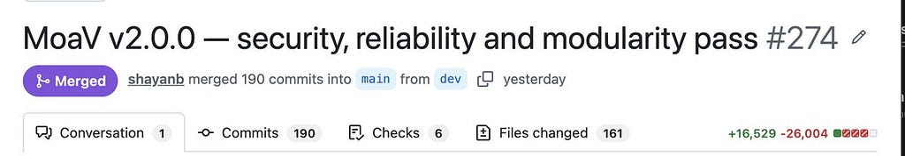
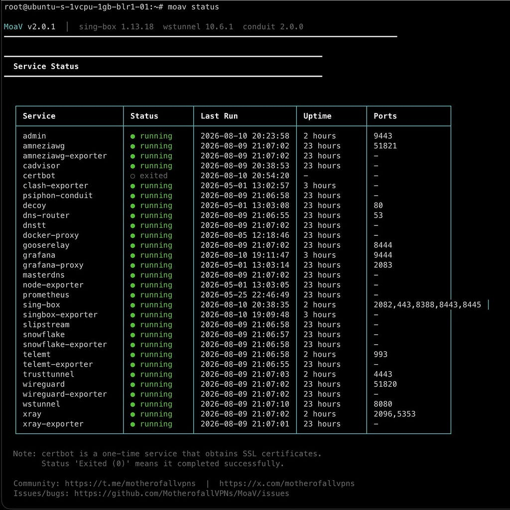
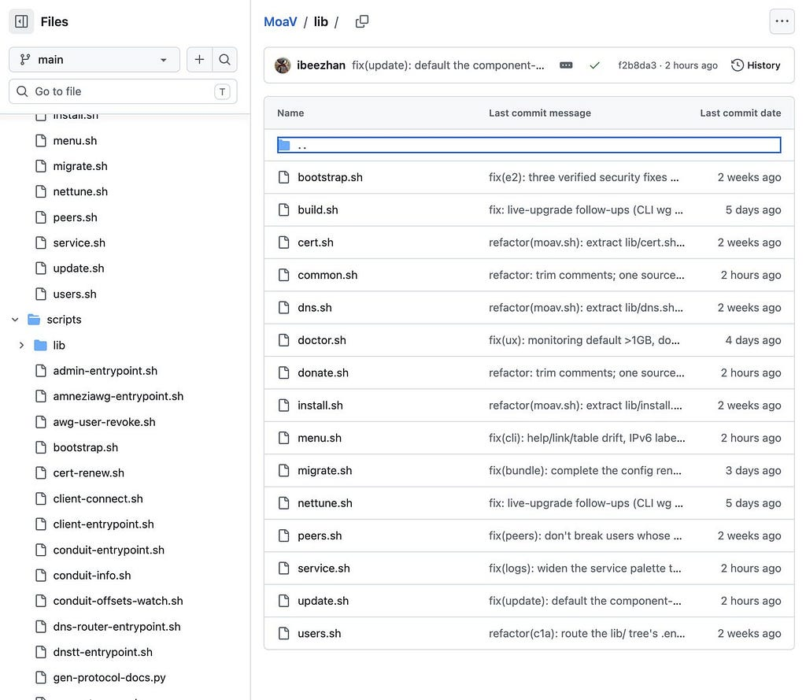
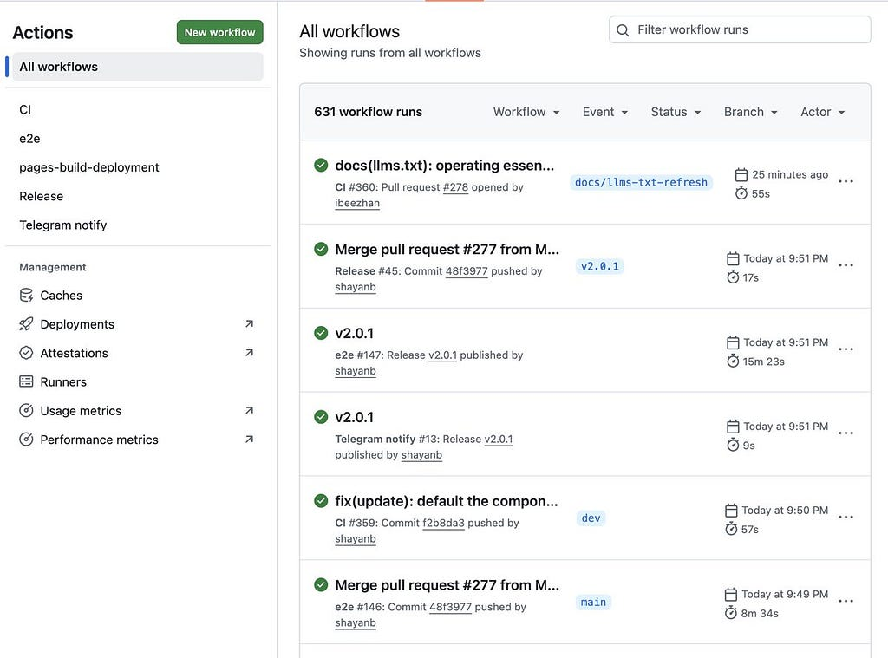
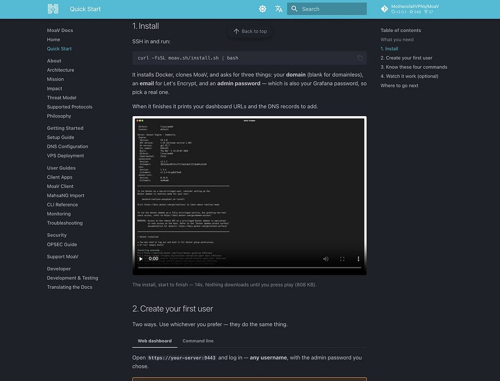
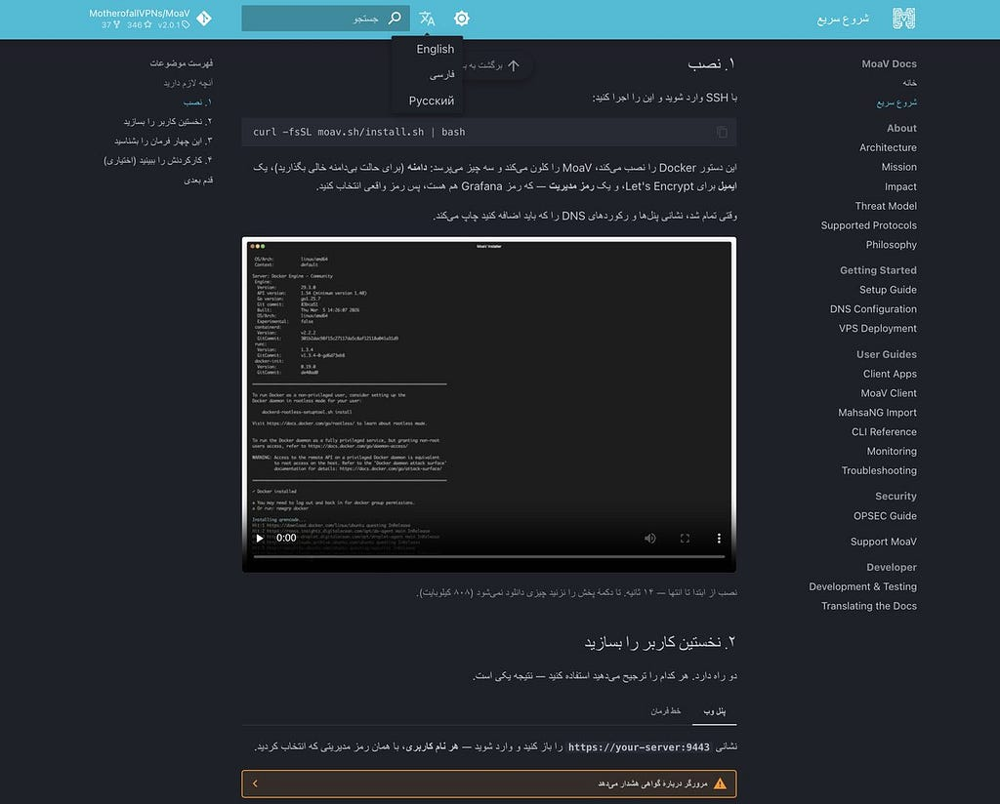

<p class="post-meta">2026-08-11 · Release · 3 min read · <a href="../../">The MoaV Blog</a></p>

# MoaV v2 is out

!!! info "Originally published on Medium"
    This post first appeared on Medium on 11 August 2026, written by Shayan Eskandari ([@sbetamc](https://x.com/sbetamc)). It is republished here unchanged: [MoaV v2 is out.](https://medium.com/@sbetamc/moav-v2-is-out-ab2fff44a9d8)

### Same 16+ protocols, rebuilt underneath. Mother of all VPNs

<figure markdown="span">

<figcaption>Mother of all VPNs — v2.0.0<br>100 PRs · 190 commits · 162 files<br>+16,801 / −25,987 lines (net −9,186)<br>tests 3 → 24 Keys, users and certificates are preserved on upgrade.</figcaption>
</figure>

1.9.x worked, but it had grown the failure modes of a fast-moving project: code nobody could safely edit, some loose security, stale experimental code. None of that shows up in a feature list. All of it decides whether the tool works on a bad day.

> MoaV 1.9 is out. Mother of All VPNs — one command, a $5 VPS, 16+ censorship-circumvention protocols on a single box. Run MoaV and you're not just getting yourself out; you're part of the free internet's infrastructure, carrying your loved ones, and strangers behind the wall, out with you. Enable [@Conduit](https://x.com/PsiphonConduit) + [@The Tor Project](https://x.com/torproject) Snowflake and someone breathes through your bandwidth tonight. The design philosophy isn't elegance, it's redundancy: the censor has to block every protocol; you only need one to get through. — — Since 1.8.4, a major anti-DPI + reliability upgrade for server and client
>
> — [the MoaV 1.9 announcement on X](https://x.com/sbetamc/status/2077116175079858405)

> Project maturity • Server and client now both under the MotherofallVPNs org. • CONTRIBUTING guide • Server: <https://github.com/MotherofallVPNs/moav> • Client: <https://github.com/MotherofallVPNs/moav-client> • <https://moav.sh>

#### Security.

Docker hardening to prevent client private key override by any local process. Metrics collection gave up its unrestricted Docker access, the admin panel is TLS-only now. Existing installs are repaired automatically on upgrade.

Independently reviewed, rather than trusting our own human read of [MoaV.sh](https://moav.sh/). No critical or high findings. One real medium: a container was quietly undoing part of the hardening every time it started. We'd been blaming that on stale images for weeks.

<figure markdown="span">

<figcaption><a href="https://moav.sh/">MoaV — Mother of all VPNs | Internet Freedom Stack</a></figcaption>
</figure>

#### Reliability.

The theme is no silent failures. Services fail loudly rather than running half-broken, and one stuck container can't wedge the rest. You could previously hand out a config that authenticated against nothing.

<figure markdown="span">

<figcaption>moav status</figcaption>
</figure>

Readability, which is really about who can contribute. The main script went from one file of 9,483 lines to 1,076, across 15 focused modules. Three near-identical copies of the provisioning logic became one, so a fix lands everywhere at once instead of one of three places.

<figure markdown="span">

<figcaption>Broken down moav.sh to 15 library files</figcaption>
</figure>

Testing. 3 scripts → 24 in CI, plus an end-to-end run that builds the whole stack on a real server with a real domain and connects through every protocol. That's the merge bar for provisioning changes. The rule: every bug found ships a test that keeps it fixed.

<figure markdown="span">

<figcaption>CI and e2e testing</figcaption>
</figure>

The docs got a full overhaul: <https://moav.sh/docs> Rewritten for readability and completeness. No more dead links or stale instructions, reorganized for easier use. There are terminal recordings you can watch before installing anything. And there's a real threat model too.

<figure markdown="span">

<figcaption>New documentation with so much more useful info</figcaption>
</figure>

Running an AI coding agent? Hand it the project.
Paste this: "Read <https://moav.sh/llms.txt> and set MoaV up on my VPS" Install steps, DNS records and safety caveats included. llms.txt indexes every doc page, llms-full.txt has all the docs.

<figure markdown="span">

<figcaption>Tell your AI agent: Read <a href="https://moav.sh/llms.txt">https://moav.sh/llms.txt</a> and set MoaV up on my VPS</figcaption>
</figure>

Translations are open, and it's most useful thing you can contribute.
Farsi and Russian are scaffolded and waiting. Untranslated pages fall back to English.
Chinese or another? File an issue on Github and we'll add the scaffolding. <https://moav.sh/docs/TRANSLATING>

<figure markdown="span">

<figcaption>Translate to your languange</figcaption>
</figure>

### Mother of all VPNs — v2 release

#### Upgrade:

```bash
moav update && moav build && moav start
```

#### Fresh Install:

```bash
curl -fsSL http://moav.sh/install.sh | bash
```

**Github**: <https://github.com/MotherofallVPNs/MoaV>

<figure markdown="span">

<figcaption>Come find me in the next conference for some cool stickers</figcaption>
</figure>

We also have a home for the community now. Join MoaV telegram channel for updates and discussions. <https://t.me/motherofallvpns>

> If you are running or interested in Mother of all VPNs (<https://moav.sh/>) , there's a telegram group to stay informed and have discussions اگر از MoaV استفاده می‌کنید و یا دوست دارید بیشتر بدانید، در گروه تلگرام زیر عضو شوید <https://t.me/motherofallvpns>

<figure markdown="span">

<figcaption><a href="https://x.com/sbetamc/status/2082710027845160971">https://x.com/sbetamc/status/2082710027845160971</a></figcaption>
</figure>

This article was originally posted as a X thread here:
<https://x.com/MotherofallVPNs/status/2087169933604008016>
