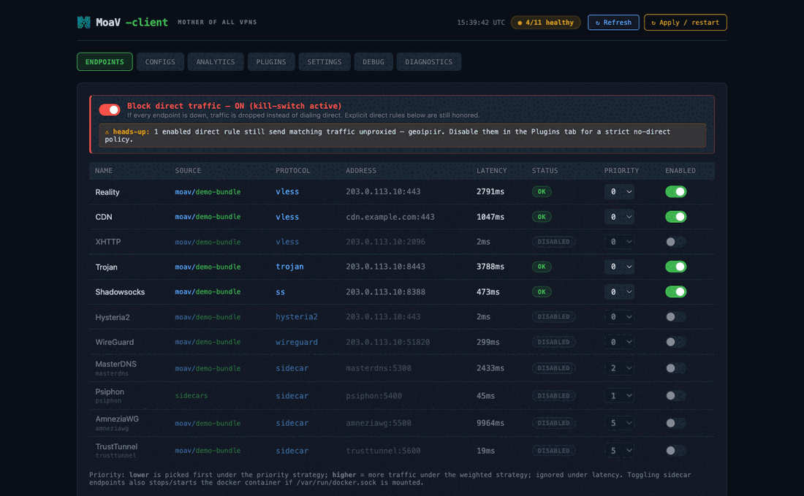

# MoaV Client

**[moav-client](https://github.com/MotherofallVPNs/moav-client)** is a standalone, self-hosted client for MoaV servers. You run it on your own Linux box, home server, or desktop; it ingests a MoaV subscription bundle, probes every endpoint end-to-end through its tunnel, load-balances across the healthy ones, and exposes a single local **SOCKS5 / HTTP CONNECT** proxy for the rest of your machine to use. A dark React dashboard — styled to match the MoaV admin panel — gives live visibility into endpoint health, per-protocol throughput, routing rules, and logs.



!!! note "How this differs from a connect-and-go app"
    Phone/desktop apps like [Hiddify, NekoBox, sing-box, or Shadowrocket](CLIENTS.md#client-apps) are the simplest way to connect a single device. **moav-client** is for when you want an always-on local proxy that automatically **picks the best live endpoint**, **fails over** when one dies, and gives you a **dashboard + routing rules** — e.g. on a home server or Linux desktop that other devices route through. It's also documented (in a simpler CLI form) under [MoaV Client Container](CLIENTS.md#moav-client-container-linuxdocker).

## Install

One command installs Docker (if missing), clones the repo, lets you pick which sidecars to build, seeds config, and brings the stack up:

```bash
curl -fsSL https://raw.githubusercontent.com/MotherofallVPNs/moav-client/main/install.sh | bash
```

It works interactively — even piped through `bash` — or fully headless, and installs a global `moavc` command.

Once it finishes, these are exposed on the local machine:

| What | Address |
|------|---------|
| Dashboard | `http://localhost:3001` |
| SOCKS5 proxy | `socks5h://localhost:1080` |
| HTTP CONNECT | `http://localhost:8081` |
| REST + WS API | `http://localhost:8088` |

Point your browser or system proxy at `socks5h://localhost:1080` — every connection then routes through the healthiest MoaV endpoint.

## Manage it with `moavc`

```bash
moavc status                # service status + health + URLs
moavc info                  # just the dashboard / proxy / API URLs
moavc logs -f proxy-core    # tail logs
moavc probe                 # trigger a latency probe
moavc sidecar add tor       # enable + build + start a sidecar
moavc expose lan            # network reach: loopback | lan | public
moavc update [-b <branch>]  # pull (optionally switch branch) + rebuild
moavc uninstall [--wipe]    # remove the stack (--wipe deletes config/data)
```

## The dashboard

The web UI at `:3001` is organized into tabs:

- **Endpoints** — live status and latency per endpoint; toggle each on/off (sidecar toggles also stop/start its Docker container) and edit priority inline.
- **Configs** — import another MoaV server's bundle by dropping its `.zip`; list, remove, and reload sources.
- **Analytics** — per-protocol upload/download with a rolling 2-minute throughput chart, plus a per-endpoint table of dials, errors, and failovers.
- **Plugins** — first-match-wins routing rules (proxy / direct / block by domain, IP CIDR, GeoIP, port…), editable live from a curated template catalog.
- **Settings** — load-balancing strategy (latency / priority / weighted), network exposure, access URLs, SNI-spoofing, and config backup / restore.
- **Debug / Diagnostics** — streaming log tail and per-endpoint connectivity checks (TCP / DNS / traceroute, optionally *through* a chosen tunnel).

## Network exposure

By default the proxy binds to loopback only. Widen it from the Settings tab or the CLI:

```bash
moavc expose loopback   # 127.0.0.1 — only this machine (default, safest)
moavc expose lan        # 0.0.0.0 — every device on your LAN can use it
moavc expose public     # LAN bind + you port-forward on your router
```

`lan` and `public` add optional SOCKS5 and dashboard authentication.

## Supported protocols

Protocol cryptography is delegated to **sing-box** (and **xray** for XHTTP), with optional sidecars for the rest:

VLESS / Reality · VLESS+WS+TLS (CDN) · Trojan · AnyTLS · Shadowsocks-2022 · Hysteria2 · VLESS+XHTTP+Reality · WireGuard · AmneziaWG · TrustTunnel · MasterDNS · Psiphon · Tor.

See the [Supported Protocols](protocols.md) reference for what each one is and when to use it.

## Learn more

Full documentation — configuration reference, architecture, plugin rules, and per-protocol dial details — lives in the repo:

- **Repository:** [github.com/MotherofallVPNs/moav-client](https://github.com/MotherofallVPNs/moav-client)
- **README:** install, config, and CLI reference (available in [English](https://github.com/MotherofallVPNs/moav-client/blob/main/README.md) and [فارسی](https://github.com/MotherofallVPNs/moav-client/blob/main/README-fa.md))
